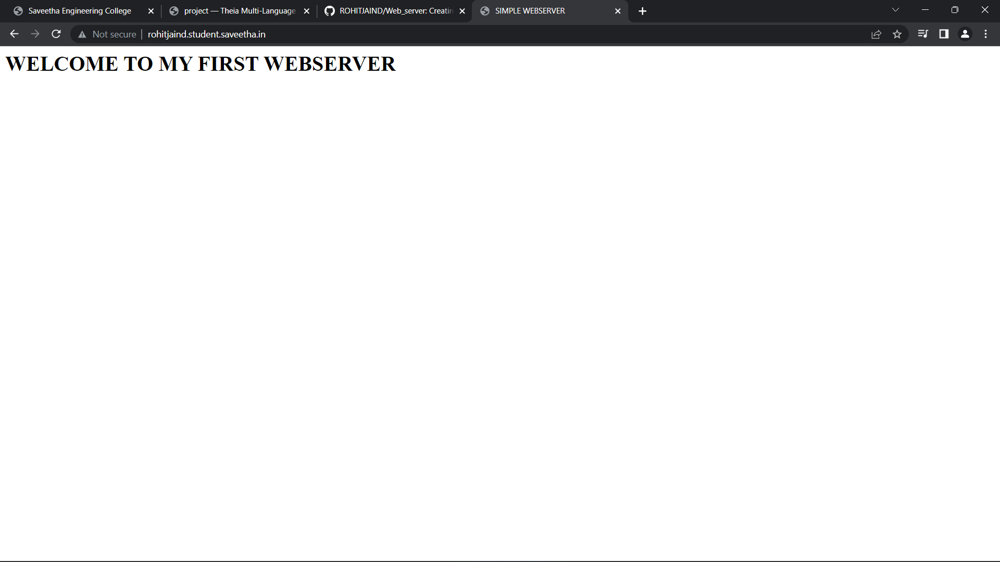

# Developing a Simple Webserver

# AIM:

Name:ROHIT JAIN .D
Ref:22005894
Dept:Artificial Intelligence and Data Science.
To develop a simple webserver to serve html programming pages.

## DESIGN STEPS:

### Step 1:

HTML content creation is done

### Step 2:

Design of webserver workflow

### Step 3:

Implementation using Python code

### Step 4:

Serving the HTML pages.

### Step 5:

Testing the webserver

## PROGRAM:  
```
from http.server import HTTPServer, BaseHTTPRequestHandler

content = """
<html>
<head>
<title>SIMPLE WEBSERVER</title>
</head>
<body>
<h1>WELCOME TO MY FIRST WEBSERVER</h1>
</body>
</html>
"""

class HelloHandler(BaseHTTPRequestHandler):
    def do_GET(self):
        self.send_response(200)
        self.send_header('Content-type', 'text/html; charset=utf-8')
        self.end_headers()
        self.wfile.write(content.encode())


server_address = ('',80)
httpd = HTTPServer(server_address, HelloHandler)
print("my server is running...")
httpd.serve_forever()
```

## OUTPUT:


## RESULT:
The program for implementing simple web is executed succesfully.
